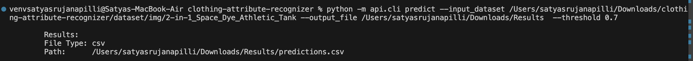
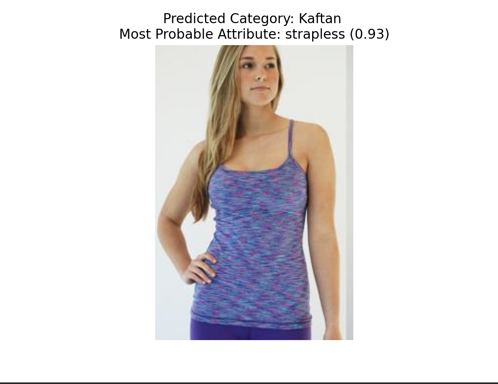
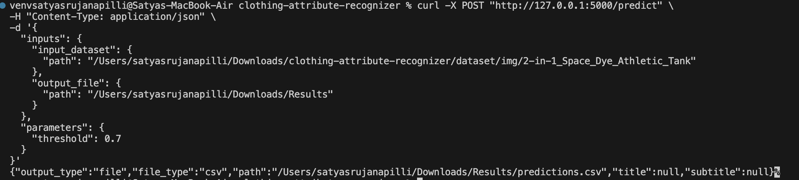
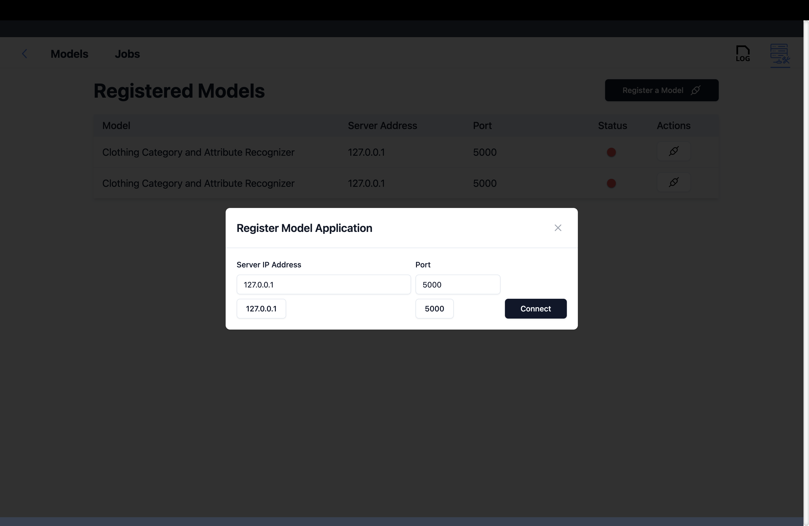
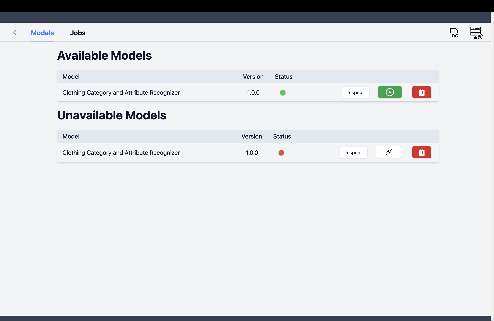
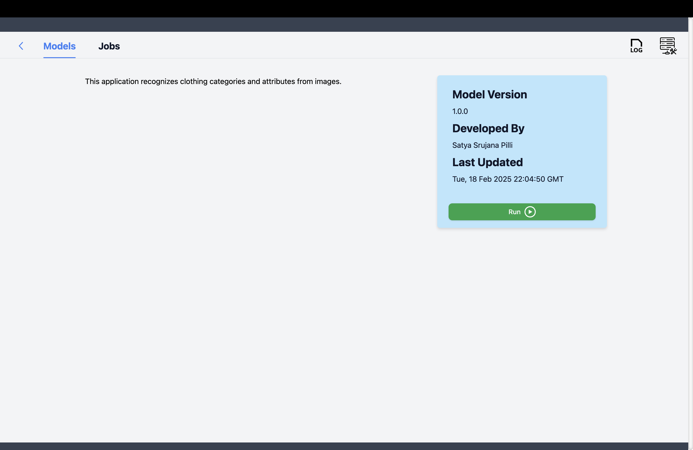
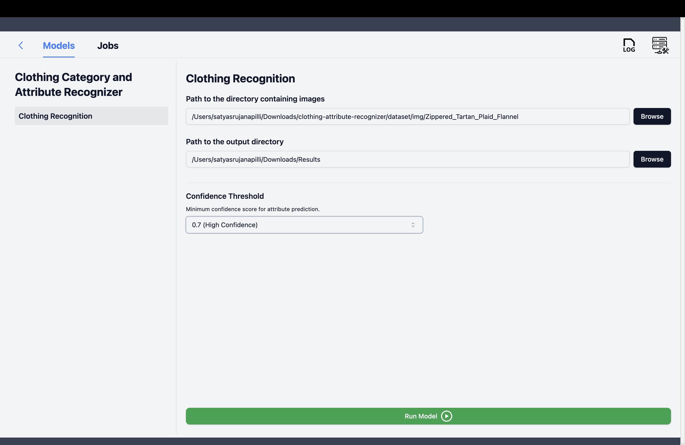
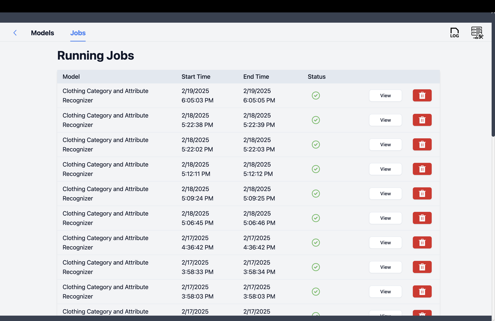
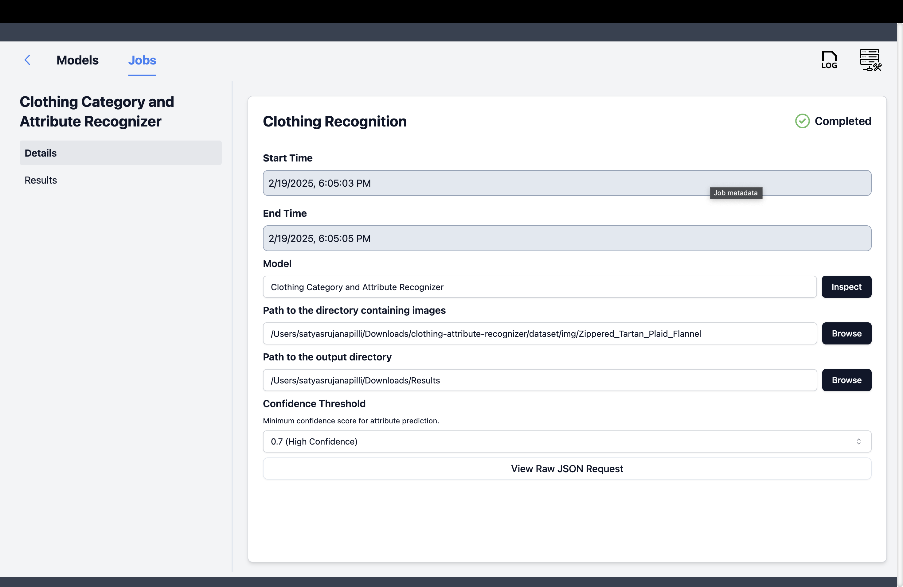

# Clothing Attribute Recognizer

The **Clothing attribute recognizer**  aims to classif y clothing **categories** and **attributes (e.g., color, material, design)** from images. It is built using a **pretrained ResNet-18 model**, exported to **ONNX format** for efficient inference via **ONNXRuntime**.

The project includes:
- **ONNX-based model inference**
- **Command Line Interface (CLI) for easy interaction**
- **API deployment using Flask-ML**

---

## Getting Started

### Prerequisites
Ensure you have the following installed:
- Python **>=3.8**
- Pip **(latest version recommended)**
- ONNXRuntime

### Clone the Repository
```bash
git clone https://github.com/mohanasrujana/clothing-attribute-recognizer.git
cd clothing-attribute-recognizer
```

### Install Dependencies
```bash
pip install -r requirements.txt
```

### Download Dataset Labels
The [**DeepFashion dataset**](https://mmlab.ie.cuhk.edu.hk/projects/DeepFashion.html) contains clothing labels that the model uses for classification.

Download the label files and place them in the `dataset/` folder:
- **Clothing categories:** `list_category_cloth.txt`
- **Clothing attributes:** `list_attr_cloth.txt`
- **img:** `img` folder

### Run Model Export (Convert PyTorch to ONNX)
```bash
python scripts/export_to_onnx.py
```

This will generate an ONNX model:
```
models/resnet_clothing_with_attributes.onnx
```

---

## Project Structure

```
📂 clothing-attribute-recognizer/
│
├── api/
│   ├── cli.py           # CLI interface for inference
│   ├── server.py        # Flask-ML server for API deployment
│
├── models/
│   ├── resnet_clothing_with_attributes.onnx  # Exported ONNX model
│
├── scripts/
│   ├── export_to_onnx.py   # Converts PyTorch model to ONNX
│   ├── run_onnx_inference.py   # Loads ONNX model & performs inference
│
├── dataset/  
│   ├── list_category_cloth.txt   # Clothing category labels
│   ├── list_attr_cloth.txt   # Clothing attribute labels
│   ├── img  # Clothing images 
│
├── requirements.txt  # Dependencies
├── README.md  # Documentation
```

---

## Key Components

### **Model Export Script (`export_to_onnx.py`)**
- Converts the modified **ResNet-18** model to **ONNX format**.
- Adds **two output heads**:
  - **Category classification** (e.g., T-shirt, jeans, dress)
  - **Attribute prediction** (e.g., red, striped, cotton)

### **ONNX Inference Script (`run_onnx_inference.py`)**
- Loads the ONNX model and performs inference on a given image.
- Returns **predicted category** and **most probable attributes**.

### **Command Line Interface (CLI) (`cli.py`)**
- Provides an easy-to-use CLI for image classification.
- Supports batch inference.

### **Flask-ML API (`server.py`)**
- Deploys the model as a web API.
- Accepts image uploads and returns predictions.

---

## How the Model is Exported to ONNX

The process of exporting the modified ResNet-18 model to ONNX format enables optimized inference using ONNXRuntime and makes the model deployment-ready across various platforms.

---

### 1. **Model Architecture Overview**

The model is based on **ResNet-18**, modified to include two separate output heads:

- **Category Head** → Predicts the clothing type (50 classes).
- **Attribute Head** → Predicts multiple clothing attributes (1000 attributes like color, material, etc.).

The original fully connected layer of ResNet-18 is replaced with two linear layers to handle these dual outputs.

---

### 2. **Exporting to ONNX Format**

The PyTorch model is exported to ONNX using the `torch.onnx.export()` function, ensuring compatibility with ONNXRuntime which can be viewed in `scripts/export_to_onnx.py`.

#### **Export Steps:**

## Steps to Export the ONNX Model

Exporting the ONNX model involved the following key steps:

1. **Initialize the modified ResNet-18 model** with two output heads:
   - **Category Head** → Predicts the clothing type (50 classes).
   - **Attribute Head** → Predicts multiple clothing attributes (1000 attributes like color, material, etc.).

2. **Set the model to evaluation mode** to ensure consistent behavior during export, especially for layers like dropout and batch normalization.

3. **Create a dummy input tensor** representing an image with shape `(1, 3, 224, 224)` to define the model's input format.

4. **Export the model to ONNX format** using the following code:

```python
import torch

torch.onnx.export(
    model,  # The modified ResNet-18 model
    torch.randn(1, 3, 224, 224),  # Dummy input
    "resnet_clothing_with_attributes.onnx",  # Output file name
    export_params=True,  # Store trained weights
    opset_version=11,  # ONNX version
    do_constant_folding=True,  # Optimize constants
    input_names=["input"],  # Name of model input
    output_names=["category_output", "attribute_output"],  # Names of model outputs
    dynamic_axes={"input": {0: "batch_size"}, "category_output": {0: "batch_size"}, "attribute_output": {0: "batch_size"}}  # Allow variable batch sizes
)
```

The resulting ONNX model will be saved as **`resnet_clothing_with_attributes.onnx`**.

This process ensures the model is ready for optimized and scalable deployment using ONNXRuntime.


## Running Inference

### CLI Usage

CLI help

``` bash
python -m api.cli --help  
```

Predicting batch of images using cli:
```bash
python -m api.cli predict --input_dataset /Users/satyasrujanapilli/Downloads/clothing-attribute-recognizer/dataset/img/2-in-1_Space_Dye_Athletic_Tank --output_file /Users/satyasrujanapilli/Downloads/Results  --threshold 0.7
```


### Running ONNX Inference Directly for a single image
Replace your image_path variable with the image location of your choice in `scripts/run_onnx_inference.py` and then run
```bash
python scripts/run_onnx_inference.py
```
the below output is for the existing image location in  `scripts/run_onnx_inference.py` file


### API Usage
Start the Flask-ML API server:
```bash
python api/server.py
```
#### Server usage (method 1)
Once running, send a POST request manually on the terminal:
```bash
curl -X POST "http://127.0.0.1:5000/predict" \
-H "Content-Type: application/json" \
-d '{
  "inputs": {
    "input_dataset": {
      "path": "/Users/satyasrujanapilli/Downloads/clothing-attribute-recognizer/dataset/img/2-in-1_Space_Dye_Athletic_Tank"
    },
    "output_file": {
      "path": "/Users/satyasrujanapilli/Downloads/Results"
    }
  },
  "parameters": {
    "threshold": 0.7
  }
}'
```


#### Server usage(method 2)
##### Use Rescue-Box-Desktop

- Install Rescue-Box from [link](https://github.com/UMass-Rescue/RescueBox-Desktop)

- Open Rescue-Box-Desktop and resgiter the model by adding the server IP address and port number in which the server is running.


- Choose the model from list of available models under the **MODELS** tab.


- Checkout the Inspect page to learn more about using the model.


- Run the model. 


- View the output in Jobs


- Click on view to view the details and results



---

## About the Model & Dataset

### ResNet-18
[ResNet-18](https://pytorch.org/vision/main/models/generated/torchvision.models.resnet18.html) is a **deep residual network** designed for image classification.
- **Pretrained on ImageNet** for strong feature extraction.
- **Modified with two output heads** for clothing classification.

### DeepFashion Dataset
[DeepFashion](https://mmlab.ie.cuhk.edu.hk/projects/DeepFashion.html) is a large-scale dataset containing:
- **200,000+ labeled images** of clothing.
- **50 clothing categories** (e.g., T-shirts, dresses, jeans).
- **1000+ attributes** (e.g., color, pattern, material).

The dataset structure:
```
dataset/
├── list_category_cloth.txt   # Clothing categories
├── list_attr_cloth.txt   # Clothing attributes
└── img/   # Clothing images
```

---

## Future Enhancements

1. **Increase the prediction accuracy** 

2. **Additional Attributes** like Sleeve length, fit type, etc.

3. **ONNX Quantization**: Optimize model for faster inference.

---


